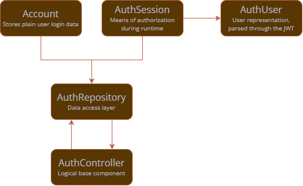

# Authentication

All authentication processes in the app rely on the Astra API.
Astra API provide a JWT session token which encodes basic user information as well as a separate 
session token that can be used for the HSMWmobil app service, therefore serving as authorization 
means for both major APIs used in this project.

This page explains the basic authentication features of the app, their interconnection and how 
they are used within the app.
The base components are shown in the following figure:



[//]: # (TODO: Add Login Workflow)

## AuthController

The `AuthController` is the logical pivot of the system and will be the access point you will 
deal with when extending the app. As it is injected globally, you can access it at any time 
using the `BuildContext` like that:
```dart
  context.read<AuthController>()
```

The following variables are the most important ones you might use:
- `isAuthenticated`: Whether the user is logged in and the current session is still valid.
- `currentAccount`: The account data the user is currently logged in with.
- `currentSession`: The last session requested from the auth service.
- `wasAuthenticatedInPast`: Whether a user has been logged in and authenticated in the past, no 
  matter the current authentication state.

## AccountData
The `AccountData` provided by the controller gives you the possibility to directly access the 
user's login data through an encrypted secure storage.
While this is a security risk in most apps, we need it as we need to inject those data in many 
web views (such as emails, learning management systems, ...).
In the future, it would be better to allow such processes through the session token, however 
this is currently not possible.
Use the following variables to use the data in the app:
- `username`: The user's login ID.
- `password`: The corresponding password.

## AuthSession
The `AuthSession` represents the actual session one may authenticate with through the Astra 
Service JWT.
Although you might probably not access them directly yourself, the following variables are used by 
other app components:
- `jwt`: The JWT.
- `user`: The user object decoded from the JWT payload.
- `appServiceToken`: The session token for the HSMWmobil app service, decoded from the JWT payload.
- `isExpired`: Whether the JWT is expired already or not.

## AuthUser
As said earlier, the session encodes user-specific information which are parsed in a separate 
`AuthUser` object within the session. There are some interesting variables we can use:
- `id`: The unique user ID given by Astra service.
- `universityId`: The unique user ID used by HSMWmobil app service.
- `displayName`: The user's real name representation (should follow the schema `Last Name, First
Name`).
- `groups`: The HSMWmobil app service the user belongs to.
- `networkShares`: The available network share paths, as given by the HSMWmobil app service.

## Specific Authed Repositories
As described in [app architecture reference](Base-Architecture.md), there are clients which 
automatically inject session data in service requests, so endpoints which require authorization 
can be accessed. There are two usable classes for this:
- `AppApiClient` for requests to the HSMWmobil app service (injecting `appServiceToken` from 
  class `AuthSession`)
- `AstraApiClient` for requests to the Astra service (injecting `jwt` from class `AuthSession`)