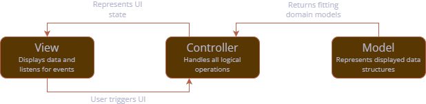

# Base Architecture

The app follows the base idea of <tooltip term="MVVM">MVVM</tooltip>, adhering to the [official 
Flutter architecture guideline](https://docs.flutter.dev/app-architecture). However, some 
adjustments are established in terms of terminology, further explained in this page.
We also provide a few samples on how to follow our guidelines in order to establish new or 
extend existing features of the app.

## MVVM Adaption

<tooltip term="MVVM">MVVM</tooltip> is adapted by using the term of **controllers** for the 
centralized logical unit instead of _view model_. The relation is as follows and also expressed 
by the diagram below:
 - The **view** is the visual element accessed by the user, therefore representing the actual 
screen which is accessed within the app. It should not contain any complex logic (exceptions are 
conditional renderings of images or animations). Interacting with the screen may trigger 
operations within the controller.
 - The **controller** (in context of <tooltip term="MVVM">MVVM</tooltip>: the _view model_) 
accepts incoming triggers of the UI and handles logical operations internally. It is responsible 
for notifying the UI when changes that need to be rendered happen and hosts all operations to 
load model data.
 - **Models** define data structures which need to be represented within the UI. This can be 
complex data models fetched by an API service or just some primitive data types needed for the 
current screen. For the latter, it is not always needed to put models into separate classes. 
Instead, variables may just be established and maintained within the controller itself.




## MVVM Implementation in Flutter

**Controllers** are based on the class 
[`ChangeNotifier`](https://api.flutter.dev/flutter/foundation/ChangeNotifier-class.html) 
which is used to notify interested entities of updates by calling the method `notifyListeners()`.
In other words, the `ChangeNotifier` might do internal operations which are triggered by data 
providers or the user within the view and calls `notifyListeners()` whenever something happens 
that would update a UI element within the view.
A sample is given below: Fields should be private and only exposed using custom properties or 
methods. Changing a field in this exemplary `CounterController` would result in a notification 
because the number has been updated.

```dart
  class CounterController extends ChangeNotifier {
    int _count = 0;
        
    int get count => _count;
        
    void increaseCount() {
      count++;
      notifyListeners(); 
    }
  }
```
{collapsible="true" collapsed-title="counter_controller.dart"}

> Here, variable `_count` implicitly represents the controller's model.
> Notice that there is no separate model class file involved in this simple example which still 
> illustrated all three major components of this <tooltip term="MVVM">MVVM</tooltip> adaption.
{style="note"}

**Views** are represented through widgets, which should depend on `ChangeNotifiers` if they 
should update through their logic.
As the notifier itself is able to re-trigger Flutter's `build()` method, the Widget can be 
created _stateless_, no matter that its content should change during runtime.
In order for the Widget to subscribe to changes of the `ChangeNotifier`, it should call 
`context.watch<T>()` where `T` stands for the relevant controller type. Not only can controller 
variables and methods be accessed, but the Widget will also automatically update, as the 
following example using the controller from above illustrates:

```dart
  class CounterScreen extends StatelessWidget {
    @override
    Widget build(BuildContext context) {
      final controller = context.watch<CounterController>();
            
      return Scaffold(
        body: Column(
          children: [
            Text(controller.count.toString()),
            ElevatedButton(
              onPressed: controller.increaseCount,
              child: Text('Click me!'),
            ),
          ],
        ),
      );
    }
  }
```
{collapsible="true" collapsed-title="counter_screen.dart"}

Lastly, watching the `ChangeNotifier` can only work if it is injected higher up in the widget 
tree, usually utilizing a `ChangeNotifierProvider` like so:
```dart
  ...
  ChangeNotifierProvider<CounterController>(
    create: (_) => CounterController(),
  ),
  ...
```
{collapsible="true" collapsed-title="main.dart"}

> In the app, all `ChangeNotifiers` are usually registered within the `BootLoader` class.

### `BaseController` and `BaseControllerBuilder`

To simplify operations that we need in almost every controller (namely, loading status and 
possible error cases), class **`BaseController`** was created. This abstract class is used by most 
existing controllers and extends `ChangeNotifier`.
It stores a state variable for whether the controller is currently loading data (`isLoading`) 
and a nullable error text (`error`) which should be `null` when there is no error. 
Both states can be set using corresponding methods `setIsLoading` or `setError`.

To simplify rendering process of `BaseControllers`, a utility Widget class 
**`BaseControllerBuilder`** was established. 
This builder needs the controller instance and a callback `builder` which is only called once 
the controller has no loading or error state.

```dart
  class ControllerTestScreen extends StatelessWidget {
    @override
    Widget build(BuildContext context) {
      final controller = context.watch<MyBaseController>();
            
      return Scaffold(
        body: BaseControllerBuilder(
          controller: controller,
          builder: () => Text('Controller loaded successfully!'),
        )
      );
    }
  }
```
{collapsible="true" collapsed-title="test_controller_screen.dart"}

> By default, errors show a centered red text and loading state is represented by a centered 
> `CircularProgressIndicator`.
> Both can be altered by a separate callback, named `errorBuilder` and `loadingBuilder`.
{style="note"}

## Constructing Models

Models may be established through separate data classes which store relevant data.
Model classes should be _immutable_, establishing the need to create a new instance when the 
model is altered. This is usually done by offering a `copyWith()` implementation.
The following sample shows a model class for the counter implementation established earlier:

```dart
  class Counter {
    Counter({required this.count}); 
    
    final int count;

    Counter copyWith({int? count}) {
      return Counter(
        count: count ?? this.count,
      );
    }
  }
```
{collapsible="true" collapsed-title="counter_model.dart"}

When having a class model, implementation in the controller shifts as well.
For the given example, the updated `CounterController` could look like this:
```dart
  class CounterController extends ChangeNotifier {
    Counter _counter = Counter(count: 0);
        
    int get count => _counter.count;
        
    void increaseCount() {
      _counter = _counter.copyWith(
        count: _counter.count + 1,
      );
      
      notifyListeners(); 
    }
  }
```
{collapsible="true" collapsed-title="counter_controller.dart"}

## Loading Data through Repositories

Coming soon...

### API Repositories

Coming soon...

### Local Repositories

Coming soon...

### Hive Repositories

Coming soon...