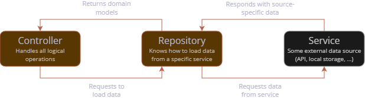

# Base Architecture

The app follows the base idea of <tooltip term="MVVM">MVVM</tooltip>, adhering to the [official 
Flutter architecture guideline](https://docs.flutter.dev/app-architecture). However, some 
adjustments are established in terms of terminology, further explained in this page.
We also provide a few samples on how to follow our guidelines in order to establish new or 
extend existing features of the app.

## MVVM Adaption

<tooltip term="MVVM">MVVM</tooltip> is adapted by using the term of **controllers** for the 
centralized logical unit instead of _view model_. The relation is as follows and also expressed 
by the diagram below:
 - The **view** is the visual element accessed by the user, therefore representing the actual 
screen which is accessed within the app. It should not contain any complex logic (exceptions are 
conditional renderings of images or animations). Interacting with the screen may trigger 
operations within the controller.
 - The **controller** (in context of <tooltip term="MVVM">MVVM</tooltip>: the _view model_) 
accepts incoming triggers of the UI and handles logical operations internally. It is responsible 
for notifying the UI when changes that need to be rendered happen and hosts all operations to 
load model data.
 - **Models** define data structures which need to be represented within the UI. This can be 
complex data models fetched by an API service or just some primitive data types needed for the 
current screen. For the latter, it is not always needed to put models into separate classes. 
Instead, variables may just be established and maintained within the controller itself.[


## MVVM Implementation in Flutter

**Controllers** are based on the class 
[`ChangeNotifier`](https://api.flutter.dev/flutter/foundation/ChangeNotifier-class.html) 
which is used to notify interested entities of updates by calling the method `notifyListeners()`.
In other words, the `ChangeNotifier` might do internal operations which are triggered by data 
providers or the user within the view and calls `notifyListeners()` whenever something happens 
that would update a UI element within the view.
A sample is given below: Fields should be private and only exposed using custom properties or 
methods. Changing a field in this exemplary `CounterController` would result in a notification 
because the number has been updated.

```dart
  class CounterController extends ChangeNotifier {
    int _count = 0;
        
    int get count => _count;
        
    void increaseCount() {
      count++;
      notifyListeners(); 
    }
  }
```
{collapsible="true" collapsed-title="counter_controller.dart"}

> Here, variable `_count` implicitly represents the controller's model.
> Notice that there is no separate model class file involved in this simple example which still 
> illustrated all three major components of this <tooltip term="MVVM">MVVM</tooltip> adaption.
{style="note"}

**Views** are represented through widgets, which should depend on `ChangeNotifiers` if they 
should update through their logic.
As the notifier itself is able to re-trigger Flutter's `build()` method, the Widget can be 
created _stateless_, no matter that its content should change during runtime.
In order for the Widget to subscribe to changes of the `ChangeNotifier`, it should call 
`context.watch<T>()` where `T` stands for the relevant controller type. Not only can controller 
variables and methods be accessed, but the Widget will also automatically update, as the 
following example using the controller from above illustrates:

```dart
  class CounterScreen extends StatelessWidget {
    @override
    Widget build(BuildContext context) {
      final controller = context.watch<CounterController>();
            
      return Scaffold(
        body: Column(
          children: [
            Text(controller.count.toString()),
            ElevatedButton(
              onPressed: controller.increaseCount,
              child: Text('Click me!'),
            ),
          ],
        ),
      );
    }
  }
```
{collapsible="true" collapsed-title="counter_screen.dart"}

Lastly, watching the `ChangeNotifier` can only work if it is injected higher up in the widget 
tree, usually utilizing a `ChangeNotifierProvider` like so:
```dart
  ...
  ChangeNotifierProvider<CounterController>(
    create: (_) => CounterController(),
  ),
  ...
```
{collapsible="true" collapsed-title="boot_loader.dart"}

> In the app, all `ChangeNotifiers` are usually registered within the `BootLoader` class.

### `BaseController` and `BaseControllerBuilder`

To simplify operations that we need in almost every controller (namely, loading status and 
possible error cases), class **`BaseController`** was created. This abstract class is used by most 
existing controllers and extends `ChangeNotifier`.
It stores a state variable for whether the controller is currently loading data (`isLoading`) 
and a nullable error text (`error`) which should be `null` when there is no error. 
Both states can be set using corresponding methods `setIsLoading` or `setError`.

To simplify rendering process of `BaseControllers`, a utility Widget class 
**`BaseControllerBuilder`** was established. 
This builder needs the controller instance and a callback `builder` which is only called once 
the controller has no loading or error state.

```dart
  class ControllerTestScreen extends StatelessWidget {
    @override
    Widget build(BuildContext context) {
      final controller = context.watch<MyBaseController>();
            
      return Scaffold(
        body: BaseControllerBuilder(
          controller: controller,
          builder: () => Text('Controller loaded successfully!'),
        )
      );
    }
  }
```
{collapsible="true" collapsed-title="test_controller_screen.dart"}

> By default, errors show a centered red text and loading state is represented by a centered 
> `CircularProgressIndicator`.
> Both can be altered by a separate callback, named `errorBuilder` and `loadingBuilder`.
{style="note"}

## Constructing Models

Models may be established through separate data classes which store relevant data.
Model classes should be _immutable_, establishing the need to create a new instance when the 
model is altered. This is usually done by offering a `copyWith()` implementation.
The following sample shows a model class for the counter implementation established earlier:

```dart
  class Counter {
    Counter({required this.count}); 
    
    final int count;

    Counter copyWith({int? count}) {
      return Counter(
        count: count ?? this.count,
      );
    }
  }
```
{collapsible="true" collapsed-title="counter_model.dart"}

When having a class model, implementation in the controller shifts as well.
For the given example, the updated `CounterController` could look like this:
```dart
  class CounterController extends ChangeNotifier {
    Counter _counter = Counter(count: 0);
        
    int get count => _counter.count;
        
    void increaseCount() {
      _counter = _counter.copyWith(
        count: _counter.count + 1,
      );
      
      notifyListeners(); 
    }
  }
```
{collapsible="true" collapsed-title="counter_controller.dart"}

## Data Models for Data Sources and Domain Models

Besides data models which just represent internal data logic, it often boils down to models 
which mimic data returned by some kind of _data source_ which could be APIs as well as local 
files or databases.
Our recommended best practice is to **always** separate a domain model (therefore, the model 
just containing data) from possible data source models (models which represent a domain-ish data 
structure).

To give an example, imagine there is a JSON API which returns a response like this:
```json
  {
    "name": "Robert",
    "age": 30
  }
```

Our goal now is to first wrap data in a domain model, which could look like this:
```dart
  class Human {
    Human({
      required this.name,
      required this.age,
    }); 
    
    final String name;
    final int age;

    Human copyWith({
      String? name,
      int? age,
    }) {
      return Human(
        name: name ?? this.name,
        age: age ?? this.age,
      );
    }
  }
```
{collapsible="true" collapsed-title="human_model.dart"}

This model now gets a data source representation for the JSON API. Such representations usually 
reflect the very same model base structure, however usually adapting utilities to construct the 
model instance (in this case, a factory constructor loading the model from JSON).
Moreover, the data source model should contain a method which returns the domain model 
representation of the very same model (in the following sample, this is done through `toDomain()`).

```dart
  class ApiHuman {
    ApiHuman({
      required this.name,
      required this.age,
    }); 
    
    factory ApiHuman fromJson(Map<String, dynamic> json) {
      return ApiHuman(
        name: json['name'] as String,
        age: json['age'] as int,
      );
    }
    
    final String name;
    final int age;

    Human toDomain() {
      return Human(
        name: name,
        age: age,
      );
    }
  }
```
{collapsible="true" collapsed-title="api_human_model.dart"}

> Domain models are not extended on purpose to keep a clean separation of concerns.

Having both model implementations, fetching API data and turning them into the domain model is a 
piece of cake and could easily be supplemented by any other implementation, such as a local storage 
loading operation:
```dart
  ...
  final json = jsonDecode(response.data);
  final human = ApiHuman.fromJson(json).toDomain();
```

## Loading Data through Repositories

As app complexity grows and multiple data sources could be involved to get a final model domain 
representation, the need for a separate data fetching layer arises. This is done through 
so-called **repositories** which are basically just ways that define how models are loaded from 
a specific data source.

Unidirectional data flow which is established through a controller "asking" for data is shown 
in the following figure:



Before we look into specific repository types covered in the app, let's start with the basics.
A repository should **always** depend on an abstract class which defines methods the repository 
covers.

Repository methods should **always** have a return type of `Future<Result<T>>` where `T` 
represents the type of domain model the repository request returns. 

While Dart-builtin `Future` stands for an asynchronous operation, the type **`Result`** is 
project-specific and plays a crucial role.
A `Result` reflects the fact that each repository request can have one of two outcomes: It can 
either _succeed_ (meaning the request was successful and provides data) or _fail_ (meaning there 
was a non-positive outcome and an error was set within the `Result`).
We will shortly cover utility that can be used to handle both possible outcomes efficiently.

> Although this is not used that much at the moment, the app already contains a `ResultBuilder` 
> which automatically handles error outcomes and otherwise provides a `builder` callback used to 
> construct a Widget from a positive data outcome.

An exemplary abstract repository class using the named aspects to get a lsit of the `Human` 
domain model defined above could look like this:
```dart
  abstract class HumanRepository {
    Future<Result<List<Human>>> loadHumans();
  }
```
{collapsible="true" collapsed-title="human_repository.dart"}

Using repositories concludes the base structure most controllers in the app use:
Usually an initialization method loads all required repository data.
Therefore, utility method `when` of the `Result` class can be used, having two important 
optional callbacks:
1. `success`: Reflects a successful response and provides the object returned.
2. `failure`: Called when the request failed, providing the error `String` as a parameter.

Within an exemplary controller, this could be used as follows for a single repository:

```dart
  class HumanController extends BaseController {
    HumanController(this._repository);
  
    final HumanRepository _repository;
    
    List<Human>? _humans;
    
    List<Human>? get humans => _humans;
    
    Future<void> initialize() async {
      setLoading(true);
    
      (await _repository.loadHumans()).when(
        success: (data) => _humans = data,
        error: setError,
      );
      
      setLoading(false);
    }
  }
```
{collapsible="true" collapsed-title="human_repository.dart"}

> We do not have to separately call `notifyListeners()` because `setLoading()` already does this 
> implicitly.

> Notice how the repository is injected using the abstract base class, meaning we can later put 
> in any `HumanRepository` (such as one loading Humans from an API or a local database).
{style="note"}

When instantiating the controller, not only some concrete repository implementation has to be 
injected (here, with an example introduced later), but also the method `initialize()` should be 
called so data is loaded once the controller is accessed for the very first time:

```dart
  ...
  ChangeNotifierProvider<HumanController>(
    create: (context) => HumanController(
      ApiHumanRepository(
        context.read<ApiClient>(),
      ),
    )..initialize(),
  ),
  ...
```
{collapsible="true" collapsed-title="boot_loader.dart"}

### API Repositories

Most repositories rely on API request. Therefore, two base classes come into play:
1. `ApiClient`: Represents some client which is used to perform the requests
2. `ClientRepository`: Base class for repositories that perform API requests.

An API repository should extend `ClientRepository` while some `APIClient` is injected into the 
class. The request itself is wrapped within the method `guardRequest()` which is provided by 
`ClientRepository`. This method makes sure to correctly handle error cases occurring during the 
request or in data parsing operations.
The following sample shows how some (imagined) endpoint could be used to load a list of the 
exemplary `Human` domain model, using the data source model shown earlier.

```dart
  class ApiHumanRepository extends ClientRepository
    implements HumanRepository {
  AppApiStudyGuideItemRepository(this._client);

  final AppApiClient _client;

  @override
  Future<Result<List<Human>>> loadHumans() {
    return guardRequest(() async {
      final response = await _client.dio.get('/humans/');
      final json = jsonDecode(response.data);
      final humans = (json as List).map((e) => ApiHuman
        .fromJson(e)
        .toDomain(),
      ).toList();
    });
  }
```
{collapsible="true" collapsed-title="api_human_repository.dart"}

> There are two specific `ApiClients` for the (currently) used APIs:
> 1. `AstraApiClient` for requests sent to the Astra service
> 2. `AppApiClient` for requests sent to the established HSMWmobil app server
> 
> These clients have all logic to automatically add their needed authentication headers.
> These repositories are already created globally and can be injected using the `read` method of 
> context, like so:
> ```dart
>   ApiHumanRepository(
>     context.read<AppApiClient>(),
>   ),
> ```

### Local Repositories

Local repositories are primarily used to save local settings. Therefore, they often reflect a 
pattern with a separate `load` and `set` method. Let's imagine a use-case where we need settings 
to save and load a username. The base repository could look like this:
```dart
  abstract class UserRepository {
    Future<Result<String>> loadUsername();
    Future<Result> setUsername(String username);
  }
```
{collapsible="true" collapsed-title="user_repository.dart"}

> Notice that for `set`-methods, our `Result` usually does not need a specific type, as we are 
> only interested in whether the operation was successful or not.

Local repositories should extend the utility base class `LocalRepository` which uses 
`GetStorage` under the hood to handle local saving and loading operations.
For the given primitive data type `String`, we can use the simple method implementations 
`readValue()` and `writeValue()` like so, while relying on an injected `GetStorage` instance and a 
specific key under which data is saved:

```dart
  abstract class LocalUserRepository {
    LocalUserRepository(super.storage);
  
    static const String usernameKey = 'username';
  
    @override
    Future<Result<String>> loadUsername() {
      return Future.value(readValue(usernameKey));
    }
    
    @override
    Future<Result> setUsername(String username) {
      return writeValue(usernameKey, username);
    }
  }
```
{collapsible="true" collapsed-title="local_user_repository.dart"}

The shown primitive methods are able to handle numeric data, boolean values and Strings. For 
more complex types there are additional utility methods:
- `readValueAsList` to read a list (the list itself can be saved using the `writeValue()` method 
  already shown for primitive data types)
- `readEnum` and `writeEnum` for enum values
- `readEnumList` and `writeEnumList` for enum list values

Injection for the `GetStorage` instance is easy as can be in the `BootLoader` through the 
created variable `getStorage`:

```dart
  LocalUserRepository(getStorage),
```

### Hive Repositories

In some cases, it could be needed to serialize entire data class structured. In such cases, 
using `GetStorage` to serialize each variable or the entire object using a JSON representation 
is not only kind of overkill, but also computation-heavy.
Instead, we use [Hive CE](https://pub.dev/packages/hive_ce), a lightweight database.

Imagine that we want to have a use-case to create, save and load our very own `Human` model data,
established earlier. For Hive, a separate data source model is created.
The class itself must provide `@HiveType` annotation with a project-unique `typeId`. We 
incrementally assign this ID, so please be aware to look up the lately added model and increment 
its type ID by 1.
In the class, each field has a `@HiveField` annotation, with an incremental value as well 
(however, this value only has to be unique within the class itself).
Moreover, as we mostly need some way to get the Hive representation from domain model, Hive 
model classes usually need a `fromDomain()` constructor.
Lastly, in order for automatic generation of boilerplate classes to work, a `part` annotation 
should be added above the class, representing a fitting class name.

An example for the `Human` Hive representation could be as follows:

```dart
  // ... Imports
  
  part 'hive_human_model.g.dart';

  @HiveType(typeId: 2)
  class HiveHuman {
    HiveHuman({
      required this.name,
      required this.age,
    }); 
    
    factory HiveHuman.fromDomain(Human human) {
    return HiveHuman(
      name: human.name,
      age: human.age,
    );
  }
    
    @HiveField(0)
    final String name;
    
    @HiveField(1)
    final int age;

    Human toDomain() {
      return Human(
        name: name,
        age: age,
      );
    }
  }
```
{collapsible="true" collapsed-title="hive_human_model.dart"}

Next up, we could imagine a repository used to load and save `Humans`.
For testability, such repositories should have the optional possibility to inject a 
`HiveInterface` which sould default to `Hive` if not set (mocked) otherwise.
Data is saved and loaded through a so called _box_ referenced by a specific key. The key should 
be set in a constant as we will need it for registration later.
While not showing the base class for simplicity, the Hive repository implementation could look 
like this:

```dart
  class HiveHumanRepository implements HumanDataRepository {
    HiveHumanRepository({HiveInterface? hive}) : _hive = hive ?? Hive;
  
    static const boxName = 'humans';
    final HiveInterface _hive;
  
    @override
    Future<Result<List<Human>>> loadHumans() async {
      final box = _hive.box<HiveHuman>(boxName);
      final list = box.values.map((e) => e.toDomain()).toList();
      return Result.success(list);
    }
  
    @override
    Future<Result> addHuman(Human human) async {
      final box = _hive.box<HiveHuman>(boxName);
      await box.add(HiveHuman.fromDomain(human));
      return const Result.success(null);
    }
  }
```
{collapsible="true" collapsed-title="hive_human_repository.dart"}

In order for Hive to generate boilerplate code for the data model, the new model has to be 
registered. This is currently done in `main.dart` as follows, using the same box name as in the 
repository itself:
```dart
  Hive.openBox<HiveHuman>(HiveHumanRepository.boxName);
```

In order for all examples to work, finally generate Hive boilerplate code using the following 
command within the project root:
```sh
  flutter pub run build_runner build --delete-conflicting-output
```