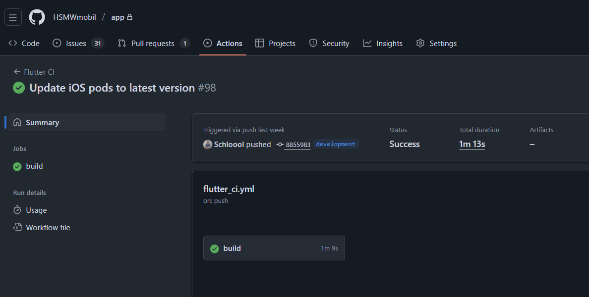
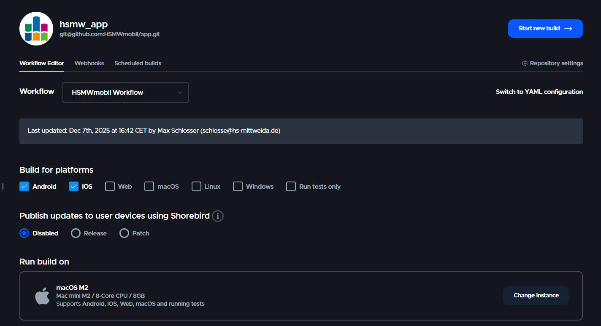
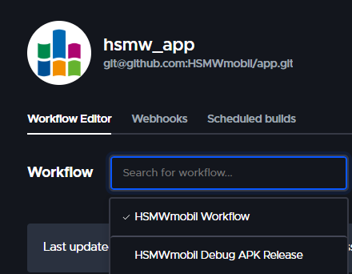
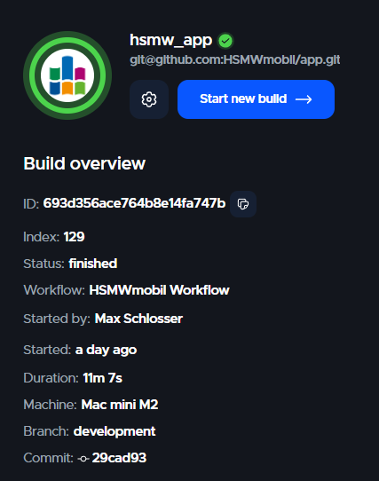

# Continuous Integration Pipelines

The app supports various automatic processes which are meant to speed up development and release 
processes. The most important ones are introduced on this page.

## GitHub Actions

GitHub Actions is used to execute automatic procedures on every push.
Currently, this only involves running all unit tests within the project. However, it is planned 
to include automatic code style checks as described in [code style reference](Code-Style.md).

Action workflows can be accessed through the 
[GitHub Actions repository page](https://github.com/HSMWmobil/app/actions).
The workflow run shows all elements which can be analyzed separately.

## CodeMagic

The app is built and signed using the [Codemagic](https://codemagic.io/) tool for the two operating
systems Android and iOS. 
In addition, the app is then uploaded to the stores and submitted for review so that it appears in
the respective stores with the latest version as quickly as possible.

### Preparing a New Build in Project
Before carrying out a build, two steps should be carried out:
- Raise the `version` property number in `pubspec.yaml`
- Provide release notes in `release_notes_de-DE.txt` and `release_notes_en-US.txt`

In addition, all changes should have been pushed in version management (git) so that the changes
can be used by the <tooltip term="CI">CI</tooltip> tool.

### Access to Codemagic
Codemagic provided the university with premium access with unlimited use of a MacMini VM. 
Access to the Codemagic project and the group must be granted manually.
For access, a request should be sent to a project administrator.

### Start a Build
At the moment, Codemagic is configured so that a new build must be triggered manually.
The automatic building and deployment of the app after a push to a specific branch
(such as the `main` branch) was deliberately avoided during the testing phase.

To trigger a build, the build overview must first be opened. 
This can be done using the corresponding button in the project overview:

After that, you can choose the branch and workflow used to start a new build. At the moment, two main workflows are used:
- `HSMWmobil Workflow`: The main workflow aiming to release a new version in Google Playstore and 
Apple App Store
- `HSMWmobil Debug APK Release`: Build a signed Android APK version which can be downloaded 
manually to test certain features (no new version is published to any store)

After finishing the build, corresponding artifacts should be generated and files will be
uploaded to the store when specified in workflow.

